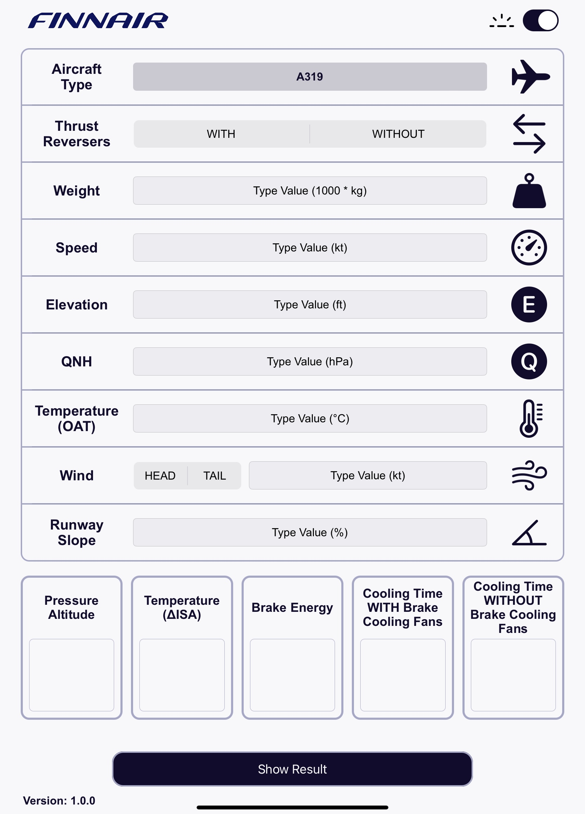
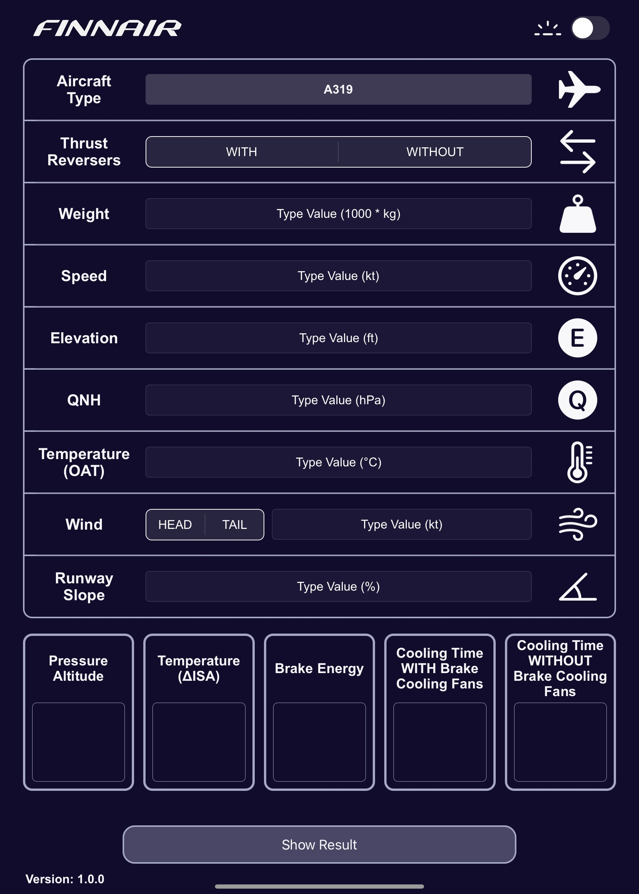
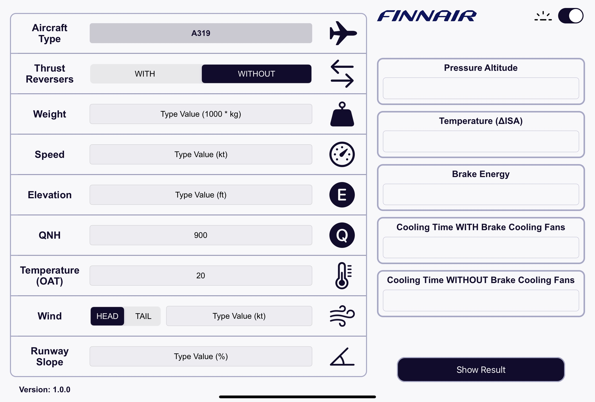

# Finnair Project

## Overview
This project was designed and developed during my internship at Finnair summer 2024 to the EFB (Electronic Flight Bag). The EFB app allows users to input specific parameters, and the application gives an output based on these parameters. The application was developed using Swift UIKit.

## Features
- **Aircraft Selection**: Choose from various aircraft models with corresponding parameters.
- **Parameter Input**: Enter values for key parameters.
- **Computation**: Compute the result based on input parameters.
- **CSV Data Parsing**: The app loads CSV files based on the parameters and calculates results.
- **Interactive UI**: Includes sliders, pickers, and segmented controls to allow easy and accurate data input for users.
- **Adaptivity**: The application supports portrait and landscape mode, in addition to light and dark mode.

## Key Components
- **TableView Cells**: Custom cells (slider, picker, time picker, custom etc.) that allow users to input data for different aircraft parameters.
- **CalculationManager**: A core logic module that handles data parsing, logic, and the calculations.

## How it Works
1. **Select Aircraft Type**: Users select an aircraft type, and the app adjusts the available parameters accordingly.
2. **Input Parameters**: Users provide values for parameters in the custom cells.
3. **Calculations**: The app processes the provided inputs, applies the logic for the selected aircraft model, and retrieves relevant values from the CSV data to do calculations.
4. **Display Results**: The result is displayed with validation checks, and users can adjust inputs to see different outcomes.

## Requirements
- iOS 13.0+
- Swift 5.0+

## Images
&nbsp;
- Portrait (light & dark)

    
    

&nbsp;
- Landscape (light & dark)

